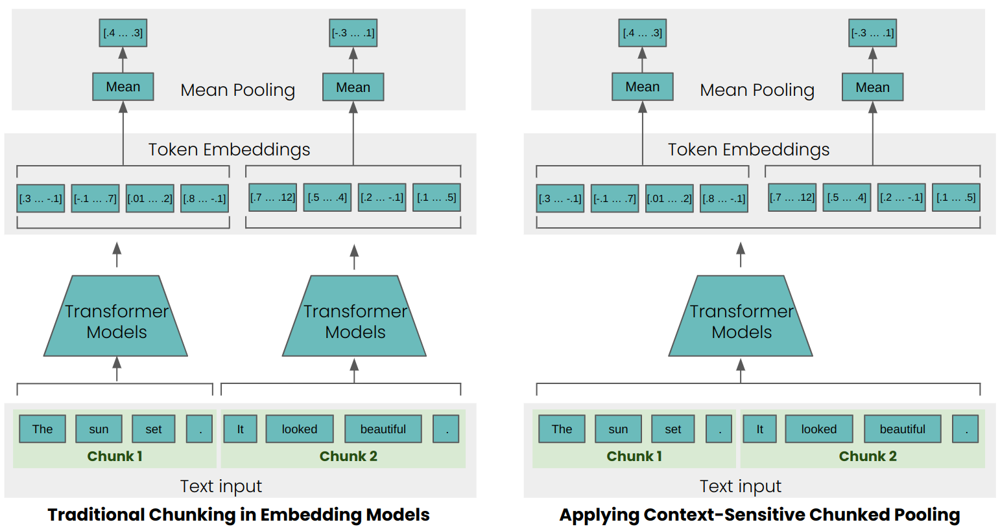

# Improve Text Embeddings of Chunks with Context-Sensitive Chunking

For many applications, encoding a whole text document into a single embedding representation is not desired.
On the one hand, many applications require retrieving smaller parts of text and 
on the other hand (TODO reference) information retrieval systems that use dense vectors often perform better when smaller parts of the documents are encoded into embedding representations because of the limited information capacity of a dense vector embedding.

One of the most famous application of such a chunking approach is RAG (Retrieval Augmented Generations).
Here a private document collections is split into smaller text chunks.
Those text chunks are encodeed by an embedding model and stored in a vector index (e.g. a vector database).
During runtime, a query text can also be encoded by the embedding model and used to retrieve the most relevant paragraphs from the vector index.
The obtained paragraphs are inserted into the prompt and an LLM is used to generate an answer by taking the relevant information from the text chunks into account.

## Context Problem

One challenging problem with this chunked retrieval approach is the context problem, i.e., many words as well as complex semantic references can not be effectively resolved by processing a single chunk.
Accordingly, additional information from other parts of the document are required.

In the image above one can see an Wikipedia article that is split into chunks of sentences.
One can see that phrases like "its" and "the city" referencing "Berlin" which is mentioned only in the first sentence, e.g., it is harder for the embedding model to link it to the respective entity to produce a high-quality embedding representation.

## The Context-Sensitive Chunking Method

To overcome this problem, we utilize the long sequence length ability of recent embedding models like [jina-embeddings-v2-base-en](https://huggingface.co/jinaai/jina-embeddings-v2-base-en).
Compared to early text-embedding models, those models allow processing larger amounts of text at once, e.g., 8192 tokens in the case of jina-embeddings-v2-base-en (~8 pages of text).
This allows us to process a long enough text such that it becomes less likely that this text contains references which cannot be resolved with information inside the text chunk.
However, we still want to obtain embedding representations of smaller text chunks to address the aforementioned limitations of encoding a long text into a single representation.

Instead of chunking the text values before applying the model (left in the Figure), we apply the transformer of the embedding model on the whole text.
After applying the transformer model for each input token, an output embedding representation is obtained.
Many embedding models like jina-embeddings-v2-base-en apply a mean pooling operation of those embeddings to obtain a single text embedding.
In the case of context-sensitive chunking, we perform the chunking on the output tokens and apply a separate mean pooling operation for each chunk.
In this way a separate embedding representation is obtained for each chunk.
The advantage of this method is that the output tokens are calculated by the transformer model by taking into account the surrounding tokens.

## The Effect of Context-Sensitive Chunking

To illustrate the effect of context-sensitive chunking, we encode the sentences from the Wikipedia paragraph with traditional and context-sensitive chunking and calculate the cosine similarity of the resulting embeddings to the embedding of "Berlin":

| Text                                                                                                                                  | Similarity Traditional | Similarity Context-Sensitive  |
|---------------------------------------------------------------------------------------------------------------------------------------|------------------------|-------------------------------|
| Berlin is the capital and largest city of Germany, both by area and by population."                                                   | 0.84862185             | 0.849546                      | 
| Its more than 3.85 million inhabitants make it the European Union's most populous city, as measured by population within city limits. | 0.7084338              | 82489026                      |
| The city is also one of the states of Germany, and is the third smallest state in the country in terms of area.                       | 0.7534553              | 0.84980094                    |

As you can see the similarity scores for the first chunk are very close to each other.
For the other two chunks they siginificantly differ, as the traditional chunking method produce embeddings which are much more dissimilar to the embedding of "Berlin" as it is harder for the model to relate the references to "Berlin" when processing the strings.

## Evaluation on Retrieval Tasks

While the example above illustrates the effect of the new chunking method quite well, it gives only little insides on how this method works in real-world application.
Therefore, we want to further investigate whether it can be used to boost a model's performance on retrieval tasks, by applying when evaluating models on some of the commonly used retrieval benchmarks from [BeIR](https://github.com/beir-cellar/beir).

